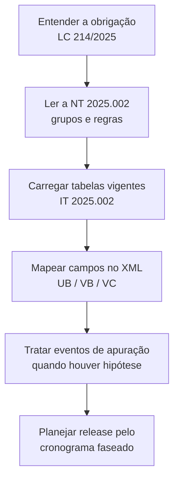

A **Reforma Tributária do Consumo (RTC)** institui três tributos novos que a NF-e e a NFC-e passaram a registrar: **IBS** (Imposto sobre Bens e Serviços), **CBS** (Contribuição sobre Bens e Serviços) e **Imposto Seletivo (IS)**. O conteúdo está dobrado, por tema, nas páginas de leiaute, eventos, tabelas e schemas. Esta seção é a **trilha única** para quem implementa a RTC: reúne os ponteiros sem reescrever cada capítulo.

> 🧭 **Overlay, não substituição.** A RTC é uma camada **posterior ao MOC 7.0** sobre os modelos 55 e 65 — não um documento novo. Os tributos de IBS/CBS/IS são lançados **"por fora"**: não substituem `vNF` nem os grupos de ICMS/PIS/COFINS existentes. Cada página abaixo liga ao capítulo dono do detalhe (Decisão 1 do plano de expansão).

## A cadeia legal → técnica

A trilha distingue **cinco camadas**, na ordem em que você as consulta para implementar (Decisão 4):

| Camada | Documento | O que define | Página |
|---|---|---|---|
| **Lei** | LC 214/2025 (alt. LC 227/2026) | institui IBS, CBS e IS; fundamenta créditos e finalidades | [LC 214/2025](/docs/reforma-tributaria/lc-214-2025) |
| **Nota Técnica** | NT 2025.002-RTC v1.50 | cria grupos, finalidades, eventos, totais e regras no leiaute | [NT 2025.002](/docs/reforma-tributaria/nt-2025-002) |
| **Informe Técnico** | IT 2025.002 v1.50 | publica `cClassTrib`, CST, `cCredPres` e indicadores | [Tabelas da RTC](/docs/reforma-tributaria/tabelas-rtc) |
| **Schema** | pacotes XSD da RTC e `Eventos_RTC` | forma do dado dos novos grupos e eventos | [Campos na NF-e/NFC-e](/docs/reforma-tributaria/campos-nfe-nfce) |
| **Cronograma** | faseamento de implantação | datas de homologação e produção por fase | [Cronograma](/docs/reforma-tributaria/cronograma) |

> ⚠️ **Não confunda NT e IT de mesmo número.** A **NT 2025.002** dá a *semântica* dos grupos e as Regras de Validação; o **IT 2025.002** dá os *valores das tabelas* que essas regras consultam. Os dois são versionados e evoluem separadamente.

## Nesta seção

| Página | O que resolve |
|---|---|
| [LC 214/2025](/docs/reforma-tributaria/lc-214-2025) | base legal da trilha; o que a lei institui e por quê |
| [NT 2025.002](/docs/reforma-tributaria/nt-2025-002) | como a Nota Técnica estrutura a RTC no leiaute |
| [IBS](/docs/reforma-tributaria/ibs) | imposto estadual/municipal: split UF + Município, base, monofasia |
| [CBS](/docs/reforma-tributaria/cbs) | contribuição federal: alíquota ad valorem, transição 2026 |
| [Imposto Seletivo](/docs/reforma-tributaria/imposto-seletivo) | tributo "do pecado": `CSTIS`, `cClassTribIS`, base e alíquota |
| [Campos na NF-e/NFC-e](/docs/reforma-tributaria/campos-nfe-nfce) | mapa transversal dos grupos `UB`/`VB`/`VC` no XML |
| [Tabelas da RTC](/docs/reforma-tributaria/tabelas-rtc) | `cClassTrib`, CST, `cCredPres`, alíquotas — versionadas e voláteis |
| [Eventos da RTC](/docs/reforma-tributaria/eventos-rtc) | apuração assistida, crédito presumido e transferência de crédito |
| [Cronograma](/docs/reforma-tributaria/cronograma) | datas de homologação/produção por fase |
| [Exemplos de XML](/docs/reforma-tributaria/exemplos-xml) | esqueleto dos grupos RTC no item e nos totais |

## Por onde começar

## Como esta seção se conecta

- Detalhe técnico dobrado (não duplicado — Decisão 1): [Tributos do item](/docs/leiaute-e-rejeicoes/tributos#ibs-cbs-e-imposto-seletivo), [Totais e fechamento](/docs/leiaute-e-rejeicoes/totais-e-fechamento), [Modelo e catálogo de eventos](/docs/eventos/modelo-e-catalogo#eventos-da-reforma-tributária) e [Tabelas e códigos](/docs/referencia/tabelas-e-codigos).
- Base legal completa em [Legislação nacional → LC 214/2025](/docs/legislacao/lc-214-2025-rtc).
- Documentos-fonte: [NT 2025.002](/docs/notas-tecnicas/2025-002) · [IT 2025.002](/docs/informes-tecnicos/2025-002) · [Cronograma de implantação](/docs/schemas/cronograma).

## Fonte

| Campo | Valor |
|---|---|
| Documento | Índice editorial: Reforma Tributária do Consumo |
| Versão | ver páginas filhas |
| Data | ver páginas filhas |
| Páginas/capítulo | trilha overlay sobre o MOC 7.0; detalhe nas páginas filhas |
| NT relacionada | NT 2025.002-RTC v1.50; demais nas páginas filhas |
| Schema/tabela relacionada | pacotes XSD da RTC; `Eventos_RTC`; IT 2025.002 v1.50 |
| Status | página índice; detalhe técnico nas páginas filhas e nos capítulos dono |

### Registro de origem

Índice editorial da trilha Reforma Tributária, criado no Estágio 5 do plano de expansão (`docs/PLANO-EXPANSAO-OPEN-FISCAL.md`). Consolida, como overlay navegável, material dobrado em [Tributos](/docs/leiaute-e-rejeicoes/tributos), [Totais e fechamento](/docs/leiaute-e-rejeicoes/totais-e-fechamento), [Eventos](/docs/eventos/modelo-e-catalogo), [Tabelas e códigos](/docs/referencia/tabelas-e-codigos), [NT 2025.002](/docs/notas-tecnicas/2025-002), [IT 2025.002](/docs/informes-tecnicos/2025-002) e [Cronograma](/docs/schemas/cronograma). Liga à base legal em [LC 214/2025](/docs/legislacao/lc-214-2025-rtc).
