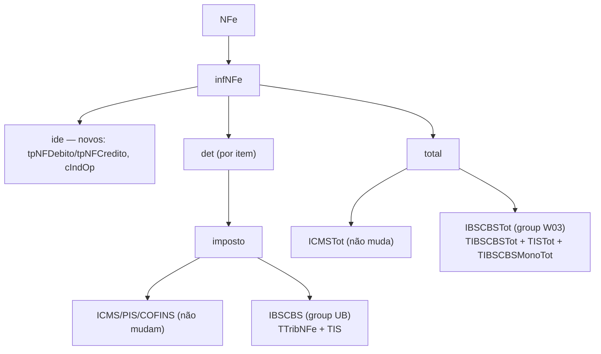

> **Fonte:** `DFeTiposBasicos_v1_00.xsd` (schema oficial da NT 2025.002) + NT 2025.002-RTC v1.33 (lida diretamente). Todos os campos aqui são **reais, tirados do XSD**, não suposições.

---

## Como encaixa na nota



**Schema novo:** `DFeTiposBasicos_v1_00.xsd` — importado por `leiauteNFe_v4_00.xsd`.

**Obrigatoriedade:** campos opcionais agora. Regime Normal obrigado por lei desde 01/01/2026. **Rejeição técnica (UB12-10):** implementação futura. Simples/MEI: a partir de 2027.

---

## Grupo UB — `IBSCBS` por item (`det/imposto`)

Dentro de `det/imposto`, ao lado de ICMS/PIS/COFINS, entra o grupo **`IBSCBS`** — composto de dois grupos independentes:

| Grupo | Tag | O que é | Oc |
|-------|-----|---------|-----|
| `IBSCBS` | `gIBSCBS` | IBS + CBS do item | 0-1 |
| `IS` | `gIS` | Imposto Seletivo | 0-1 |

### Grupo `IBSCBS` — tipo `TTribNFe`

| Campo | Tag | Tipo | Oc | O que é |
|-------|-----|------|----|---------|
| `CST` | `CST` | `TCST` (3 dígitos) | 1 | CST do IBS/CBS (tabela abaixo) |
| `cClassTrib` | `cClassTrib` | `TcClassTrib` | 1 | Classificação Tributária (vincula ao artigo da LC 214/2025) |
| `indDoacao` | `indDoacao` | bool | 0-1 | Indica se é doação |
| `gIBSCBS` | **choice** | `TCIBS` | 0-1 | Tributação regular |
| `gIBSCBSMono` | **choice** | `TMonofasia` | 0-1 | Tributação monofásica (CST 620) |
| `gTransfCred` | **choice** | `TTransfCred` | 0-1 | Transferência de crédito (CST 800) |
| `gAjusteCompet` | **choice** | `TAjusteCompet` | 0-1 | Ajuste de competência (CST 811) |
| `gCredPresOper` | **choice** | `TCredPresOper` | 0-1 | Crédito presumido da operação |

> O `choice` entre `gIBSCBS`, `gIBSCBSMono`, `gTransfCred` e `gAjusteCompet` é **discriminado pelo CST**. Use `gIBSCBS` para tributação normal.

---

### `TCIBS` — tributação regular (`gIBSCBS`) — o mais usado

Estrutura hierárquica: um `vBC` compartilhado + dois subgrupos: `gIBSUF` (estadual) e `gIBSMun` (municipal) + `gCBS` (federal).

| Campo | Tipo | Oc | O que é |
|-------|------|----|---------|
| `vBC` | `TDec1302RTC` | 1 | Base de cálculo compartilhada (IBS + CBS usam o mesmo vBC) |
| **`gIBSUF`** | grupo | 1 | IBS estadual |
| `pIBSUF` | dec 3-4 casas | 1 | Alíquota IBS-UF (%) |
| `gDif` | `TDif` | 0-1 | Diferimento IBS-UF (`pDif`, `vDif`) |
| `gDevTrib` | `TDevTrib` | 0-1 | Devolução/cashback IBS-UF (`vDevTrib`) |
| `gRed` | `TRed` | 0-1 | Redução IBS-UF (`pRedAliq`, `pAliqEfet`) |
| `vIBSUF` | `TDec1302RTC` | 1 | Valor IBS-UF calculado |
| **`gIBSMun`** | grupo | 1 | IBS municipal (mesma estrutura que `gIBSUF`) |
| `pIBSMun` | dec 3-4 casas | 1 | Alíquota IBS-Mun (%) |
| `vIBSMun` | `TDec1302RTC` | 1 | Valor IBS-Mun calculado |
| **`gCBS`** | grupo | 1 | CBS (federal) |
| `pCBS` | dec 3-4 casas | 1 | Alíquota CBS (%) |
| `gDif` | `TDif` | 0-1 | Diferimento CBS |
| `gDevTrib` | `TDevTrib` | 0-1 | Devolução CBS/cashback |
| `gRed` | `TRed` | 0-1 | Redução CBS |
| `vCBS` | `TDec1302RTC` | 1 | Valor CBS calculado |

---

### `TIS` — Imposto Seletivo (`gIS`)

| Campo | Tipo | Oc | O que é |
|-------|------|----|---------|
| `CSTIS` | `TCST` | 1 | CST do IS (tabela própria, Anexo II da NT) |
| `cClassTribIS` | `TcClassTrib` | 1 | Classificação tributária IS |
| `vBCIS` | `TDec1302RTC` | 0-1 | Base de cálculo IS |
| `pIS` | dec 3-4 casas | 0-1 | Alíquota IS (%) |
| `pISEspec` | dec 3-4 casas | 0-1 | Alíquota IS por valor (ad rem) |
| `uTrib` | str 1-6 | 0-1 | Unidade medida para ad rem |
| `qTrib` | dec 11,4 | 0-1 | Quantidade base ad rem |
| `vIS` | `TDec1302RTC` | 0-1 | Valor IS calculado |

> IS se aplica só a NCMs específicos listados no **Anexo I da NT 2025.002** (bebidas alcoólicas, tabaco, veículos, embarcações, aeronaves, bens minerais, produtos de alto carbono). Maioria das operações = IS não se aplica.

---

## Grupo W03 — `IBSCBSTot` (total da nota)

Fica dentro de `total`, ao lado do `ICMSTot` existente.

| Campo | Tipo | O que é |
|-------|------|---------|
| `vBCIBSCBS` | `TDec1302RTC` | Total da base de cálculo IBS+CBS |
| `gIBS/gIBSUF/vIBSUF` | `TDec1302RTC` | **Total IBS estadual** |
| `gIBS/gIBSMun/vIBSMun` | `TDec1302RTC` | **Total IBS municipal** |
| `gCBS/vCBS` | `TDec1302RTC` | **Total CBS** |

`TISTot` → `vIS` (valor total IS da nota).

---

## Novos campos no `ide`

| Tag | O que é | Valores |
|-----|---------|---------|
| `tpNFDebito` | Tipo da Nota de Débito | `1`=Normal `2`=Complementar `3`=Ajuste `4`=Retorno de mercadoria `5`=Anulação de valor `6`=Retorno por recusa parcial |
| `tpNFCredito` | Tipo da Nota de Crédito | valores similares |
| `cIndOp` | Indicador local da operação de fornecimento | tabela por `tpEnteGov` |

---

## CST do IBS/CBS (TCST = 3 dígitos)

O CST do IBS/CBS é de **3 dígitos** (diferente do CST ICMS de 2 dígitos).

| CST | Significado |
|-----|-------------|
| `001` | Tributação regular — regra geral |
| `100` | Imunidade |
| `200` | Isenção |
| `300` | Não incidência / fora do campo |
| `400` | Suspensão |
| `500` | Diferimento |
| `600` | Redução de alíquota |
| `620` | **Monofásica** |
| `700` | Crédito presumido da operação |
| `800` | Transferência de crédito |
| `811` | Ajuste de competência |

> A tabela `cClassTrib` é **extensa e dinâmica** — cada código vincula a um artigo específico da LC 214/2025. Trate como **dado versionado** (JSON), não constante no código. Disponível no portal em Documentos → Diversos → Informe Técnico 2025.002.

---

## Como modelar na lib

```ts
type IbsCbs =
  | { CST: "001" | "600"; cClassTrib: string; gIBSCBS: TCIBS }
  | { CST: "620"; cClassTrib: string; gIBSCBSMono: TMonofasia }
  | { CST: "800"; cClassTrib: string; gTransfCred: TTransfCred }

type TCIBS = {
  vBC: string
  gIBSUF: {
    pIBSUF: string
    gDif?: { pDif: string; vDif: string }
    gDevTrib?: { vDevTrib: string }
    gRed?: { pRedAliq: string; pAliqEfet: string }
    vIBSUF: string
  }
  gIBSMun: {
    pIBSMun: string
    vIBSMun: string
  }
  gCBS: {
    pCBS: string
    vCBS: string
  }
}

// Adicionar em Imposto como campos opcionais:
class Imposto {
  constructor(d: {
    icms: Icms; pis: Pis; cofins: Cofins; ipi?: Ipi;
    ibsCbs?: IbsCbs;  // opcional agora, obrigatório Regime Normal 2026
    is?: IS;           // só NCMs específicos do Imposto Seletivo
  }) {}
}
```

---

## Checklist de implementação

- [ ] Adicionar `DFeTiposBasicos_v1_00.xsd` ao conjunto de validação
- [ ] `Imposto` aceita `ibsCbs?` e `is?` opcionais
- [ ] `ibsCbs` modelado como union por CST (3 dígitos)
- [ ] `TCIBS` com `gIBSUF` + `gIBSMun` + `gCBS` (3 subgrupos separados)
- [ ] `IBSCBSTot` no `total` (soma item por item, decimal.js)
- [ ] `tpNFDebito`/`tpNFCredito`/`cIndOp` no builder do `Ide`
- [ ] Tabela `cClassTrib` como dado JSON versionado
- [ ] `CRT=1/2/4` (Simples/MEI): só obrigado a partir de **2027**, deixar fora por enquanto
- [ ] `cStat` 4 dígitos agora aceito (era 3) — atualizar parser de retorno
- [ ] `nProt` pode ter 15 **ou** 17 dígitos — atualizar `TProt` no validador
