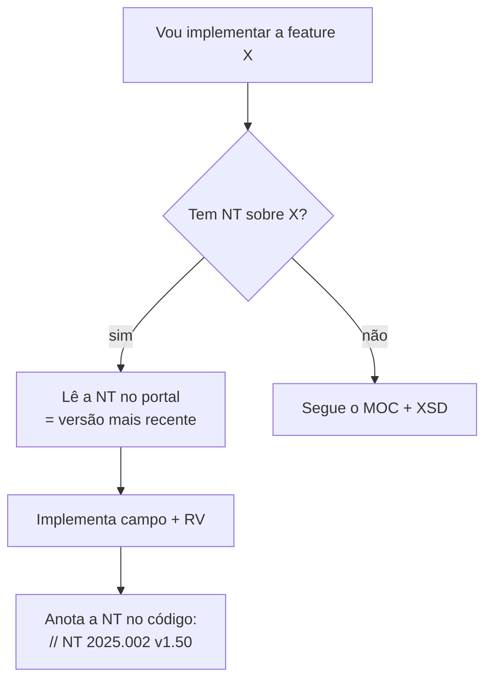

> **Pra que serve:** o que muda na NF-e/NFC-e vem por **Nota Técnica (NT)**, não por nova versão do MOC. Esta é a lista **curada e vigente** (junho/2026) das NTs que **impactam uma lib de 55/65**, com o que cada uma mudou e onde mexer.
>
> Fonte: Portal NF-e → Documentos → Notas Técnicas. **Sempre confira a versão mais recente de cada NT no portal** — elas ganham subversões continuamente.

---

## As que mais importam agora (leia primeiro)

| NT | Versão / data | O que muda | Impacto na lib |
|----|---------------|------------|----------------|
| **2025.002** | v1.50 (06/2026) | **Reforma Tributária (RTC): IBS/CBS/IS** — novos campos e RV | Grupos `IBSCBS` (item) + `IBSCBSTot` (total) + `IS`. Base legal **EC 132/2023 + LC 214/2025**. Incidência **desde 01/01/2026**, mas **rejeição por ausência adiada** (regra UB12-10/rej.1115) → hoje **não rejeita**. Regime Normal obrigado 2026; Simples/MEI 2027. |
| **2026.004** | v1.01 (06/2026) | **CNPJ alfanumérico** (schema) | CNPJ deixa de ser só `[0-9]{14}`. Reveja **tipos e validação de CNPJ**. |
| **2025.001** | v1.03 (09/2025) | **QR-Code v3** (NFC-e) + **resposta síncrona** obrigatória p/ lote de 1 NF-e | QR sem CSC + fluxo de transmissão muda |
| **2024.003** | v1.10 (05/2026) | Campos de **trânsito de produtos animais/vegetais/florestais** | Grupo `agropecuario` no item (já no XSD) |
| **2024.001** | v1.20 (2024) | **CRT=4 (MEI)** pode emitir NF-e/NFC-e | Adicionar `MEI` ao enum `CRT` |

> O XSD que você subiu **já contém** `IBSCBS`, `agropecuario` e `gCompraGov` → alinhado com **2025.002 + 2024.003**. Falta só acompanhar o **CNPJ alfanumérico (2026.004)**.

---

## NTs de leiaute / campos (mexem nos tipos e builders)

| NT | Tema | Onde mexe |
|----|------|-----------|
| **2025.002** | IBS/CBS (Reforma Tributária) | `Imposto` (novo `ibsCbs`), `Total`, novos CST |
| **2026.004** + Conjunta 2025.001 | CNPJ alfanumérico | tipos `TCnpj`, validador CNPJ |
| **2024.003** | grupo `agropecuario` (defensivo, guia trânsito) | `Prod`/item |
| **2018.005** v1.52 | local de retirada/entrega, transportador, `modFrete` | `Retirada`/`Entrega`/`Transp` |
| **2023.001** v1.60 | **Tributação monofásica de combustíveis** | ICMS CST `02/15/53/61`, campos `qBCMono`, `vICMSMono...` |
| **2024.001** | CRT=4 (MEI) | enum `CRT` |
| **2015.003** | **DIFAL** — ICMS interestadual a consumidor final | grupo `ICMSUFDest` |
| **2021.003** v1.40 | regras de **GTIN** (`cEAN`/`cEANTrib`) | validação do produto |

---

## NTs de serviços / transmissão (mexem no SefazClient)

| NT | Tema | Impacto |
|----|------|---------|
| **2025.001** | **Resposta síncrona obrigatória** p/ lote de 1 NF-e (`indSinc=1`); QR v3 | simplifica fluxo: não precisa mais recibo p/ nota única |
| **2023.002** | **NFC-e: elimina denegação e lote**; permite Produtor Rural PF | NFC-e não usa lote/denegação |
| **2026.001** | **PAA – Provedor de Assinatura e Autorização** | novo intermediário de assinatura/autorização |
| **2014.002** v1.30 | **NFeDistribuicaoDFe** (baixar DF-e emitidos contra você) | serviço de distribuição |
| **2020.001** v1.60 | manifestação do destinatário | eventos |

> **Mudança de atraso na emissão (NT 2025.001):** NF-e (55) agora aceita data de emissão com no máximo **7 dias** de atraso (antes 30). Além disso → `cStat=150` (autorizado fora de prazo) ou exige contingência. NFC-e (65) → máximo **5 minutos** entre emissão e autorização.

---

## NTs de eventos (cada um é um XML assinado próprio)

| NT | Evento | tpEvento |
|----|--------|----------|
| 2011.006 / 2013.008 | **Cancelamento** | `110111` |
| 2010.008 / 2011.003 | **Carta de Correção (CC-e)** | `110110` |
| 2014.001 | **EPEC** (contingência) | `110140` |
| 2018.004 | **Cancelamento por substituição** (NFC-e) | `110112` |
| 2020.001 | **Manifestação do destinatário** (4 tipos) | `2101xx` |
| 2020.007 v1.40 | **Ator interessado** (informar transportador) | `110150` |
| 2021.001 | **Comprovante de entrega** | `110130` |
| 2023.005 | **Insucesso na entrega** | `110192` |
| 2024.002 | **Conciliação financeira (ECONF)** | consultar NT |

> Os números de `tpEvento` podem variar/atualizar — **confirme na NT** antes de implementar.

---

## NTs de DANFE

| NT | Tema |
|----|------|
| **2026.002 / 2026.003** | **DANFE Simplificado Tipo 2** (vendas presenciais e não presenciais) |
| **2020.004** v1.10 | DANFE Simplificado **Etiqueta** (e-commerce/logística) |
| **2025.001** | **QR-Code v3** (NFC-e) |

---

## NTs de tabelas (dados, não código)

| NT / Informe | Tabela |
|--------------|--------|
| Informe Técnico 2024.001 | **NCM** + unidade tributável Comex |
| 2017.002 | **CFOP** (novos códigos) |
| 2018.003 | Países |
| 2020.002 | Enquadramento **IPI** |

> Essas viram **dados versionados** na sua lib (JSON), não regras hard-coded. Atualize quando a NT/Informe sair.

---

## Como usar este índice na prática

- **Antes de implementar qualquer grupo/campo**, cheque se há NT.
- **Anote no código** de qual NT/versão veio (`// origem: NT 2024.003 v1.10`).
- **Fixe o pacote XSD (PL)** correspondente — não pegue "o mais novo" sem ler a NT.
- A lista de **`cStat` de rejeição** com seus números está **dentro de cada NT** e no **Anexo I**.

> **Visão de futuro:** o sistema caminha pra **IBS/CBS (RTC)** + **CNPJ alfanumérico** + **QR v3 sem CSC** + **PAA**. Se o projeto é pra durar, deixe a arquitetura pronta pra esses quatro — todos cabem como "mais um campo/builder/serviço", não reescrita.
