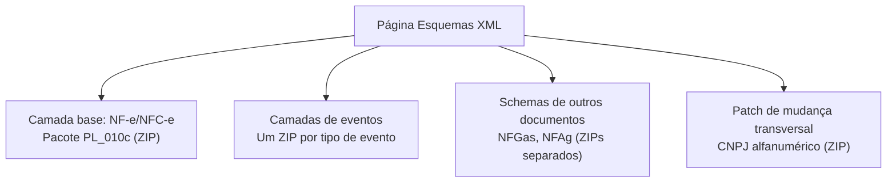

> **TL;DR:** A página de Esquemas XML do portal lista TUDO junto (schemas para uso, schemas velhos, schemas de outros documentos como NFGas). **Não existe um único ZIP "o schema de hoje"** — existem **camadas** que se somam. Este arquivo explica a lógica e diz exatamente qual ZIP usar para quê.

---

## Como a página de Schemas funciona

O portal usa a seção **"VERSÕES OFICIAIS (em uso)"** como título, mas mistura três coisas:



**As regras que ninguém explica:**

1. **O Pacote PL (Pacote de Liberação)** é o schema base da nota. Hoje é o **PL_010c**. Ele tem o `leiauteNFe`, `tiposBasico`, `nfe`, `envEnvNFe`, `consSit`, `inut`, etc. **Este é o que você usa pra validar o XML da nota**.
2. **Eventos são ZIPs separados** — cada tipo de evento tem seu próprio schema, publicado à parte. Você **precisa de todos** os que usar.
3. **NFGas e NFAg são documentos diferentes** da NF-e — têm schemas próprios. **Se você só faz NF-e/NFC-e, ignore esses ZIPs**.
4. **O ZIP do CNPJ alfanumérico** (NT 2026.004) é um **patch** — ele atualiza os tipos de CNPJ e chave nos schemas existentes. Entra em produção **01/07/2026**.
5. **A RTC (NT 2025.002)** tem um ZIP de eventos separado — os eventos novos do IBS/CBS.

---

## Tabela Completa dos Schemas Vigentes (jun/2026)

| Entrada na página | O que contém | Lib precisa? |
|-------------------|--------------|-------------|
| **Schemas CNPJ Alfanumérico NT 2026.004.v.1.01** | `tiposBasico_v1_03.xsd` + schemas alfanuméricos | **SIM** (a partir de 01/07/2026) |
| **Esquema NF-e/NFC-e PL_010c (NT 2022.002 v.1.30)** | `leiauteNFe_v4_00`, `nfe_v4_00`, `tiposBasico_v4_00`, `consSitNFe_v4_00`, `leiauteInutNFe_v4_00`, etc. | **SIM — este é o base** |
| **Schema eventos NT 2025.002 v.1.30 – RTC** | Eventos do IBS/CBS (novos `tpEvento` da Reforma) | Sim se implementar IBS/CBS |
| **Evento Cancelamento** | `tpEvento=110111` | **SIM** |
| **Evento Cancelamento por Substituição (NFC-e)** | `tpEvento=110112` (NT 2018.004) | Se fizer NFC-e |
| **Evento Conciliação Financeira (ECONF)** | NT 2024.002 | Opcional |
| **Evento Insucesso na Entrega** | NT 2023.005 | Opcional |
| **Distribuição DF-e v1.03** | `NFeDistribuicaoDFe` | Se implementar DFe |
| **Evento Comprovante de Entrega** | NT 2021.001 | Opcional |
| **Evento Ator Interessado – Transportador** | NT 2020.007 | Opcional |
| **Schemas NFGas / NFAg** | Outros documentos | Não (outro documento) |

---

## Qual ZIP baixar pra minha lib NF-e/NFC-e?

### MVP (emitir + cancelar + consultar):
1. **PL_010c** → o schema da nota (validar o XML)
2. **CNPJ Alfanumérico** → a partir de 01/07/2026
3. **Evento Cancelamento** → para validar o XML do evento

### + NFC-e:
4. **Evento Cancelamento por Substituição** (NFC-e)

### + Mais eventos (roadmap):
5. **RTC NT 2025.002** → para os eventos IBS/CBS
6. **Comprovante de Entrega**, **Ator Interessado**, **ECONF** → conforme necessidade

---

## Como montar seu "pacote de schemas fixado" na lib

```
lib/
  schemas/
    base/
      leiauteNFe_v4_00.xsd        ← do PL_010c
      tiposBasico_v4_00.xsd       ← do PL_010c  (pré-01/07/2026)
      tiposBasico_v1_03.xsd       ← CNPJ alfanum (pós-01/07/2026)
      nfe_v4_00.xsd               ← do PL_010c
    eventos/
      leiauteEvento_v1_00.xsd
      envEvento_v1_00.xsd
      retEnvEvento_v1_00.xsd
    consultas/
      consSitNFe_v4_00.xsd
      consCad_v2_00.xsd
    inutilizacao/
      leiauteInutNFe_v4_00.xsd
  SCHEMAS_VERSAO.md               ← registra qual PL e quais ZIPs estão fixados
```

---

## NTs Vigentes Consolidadas (jun/2026)

### NT 2026.004 v1.01 — CNPJ Alfanumérico

**Homologação:** 15/06/2026 · **Produção:** 01/07/2026

- `TCnpj` → `[0-9A-Z]{12}[0-9]{2}` (12 alfanum + 2 DV numérico)
- `TChNFe` (chave) → `[0-9]{6}[0-9A-Z]{12}[0-9]{26}` (trecho do CNPJ pode ter letra)

**Impacto no validador:**
```ts
// ANTES: /^\d{14}$/ e /^\d{44}$/
// DEPOIS:
const CNPJ = /^[0-9A-Z]{12}[0-9]{2}$/
const CHAVE = /^[0-9]{6}[0-9A-Z]{12}[0-9]{26}$/
// DV: letra = charCode - 48 (A=17, B=18 ... Z=42)
```

### NT 2025.002-RTC v1.50 — Reforma Tributária (03/06/2026)

**Base:** EC 132/2023 + LC 214/2025 · **Obrigatoriedade (RV UB12-10):** Implementação futura

Grupos novos no XML: `IBSCBS` + `IS` (por item) e `IBSCBSTot` (no total). Ver IBS/CBS/IS para detalhes completos.

**Cronograma restante:**
- `v1.36` → homologação 01/07/2026, produção 03/08/2026
- Devolução obriga `DFeReferenciado` → produção 01/09/2026
- `v1.50` → produção 03/11/2026 (monofásica combustíveis reformulada)
- Obrigatoriedade UB12-10 → **data não definida**

### NT 2025.001 v1.03 — QR v3 + Síncrono (09/2025)

Ver DANFE/NFC-e e Transmissão/Webservices.

### NT 2024.003 v1.10 — Trânsito Agropecuário

Grupo `agropecuario` no item — campos para trânsito de animais vivos, vegetais e florestais. Já presente no XSD atual.

### NT 2024.001 v1.20 — CRT=4 (MEI)

`CRT=4` (MEI) pode emitir NF-e/NFC-e. MEI com CRT=4 usa CSOSN do Simples (igual CRT=1).

### NT 2023.002 v1.01 — NFC-e sem Denegação/Lote

NFC-e não é mais denegada por irregularidade cadastral. NFC-e só aceita resposta síncrona (lote de 1).

### NT 2023.001 v1.60 — Tributação Monofásica Combustíveis

Novos CST ICMS: `02`, `15`, `53`, `61`. Campos `qBCMono`, `adRemICMS`, `vICMSMono`, etc. Só afeta combustíveis.

### NT 2022.005 v1.11 — DIFAL Interestadual

Regras do grupo `ICMSUFDest` quando `idDest=2` e `indFinal=1`.

### NT 2021.003 v1.40 — Validação GTIN

`cEAN` e `cEANTrib` com GTIN são validados contra o Cadastro Centralizado de GTIN da Receita. Se não tem, use `SEM GTIN`.

### NT 2019.001 v1.70 — cBenef e Regras ICMS

`cBenef` (Código de Benefício Fiscal) — campo obrigatório em operações com CST que implicam benefício fiscal. Tabela `cBenef` é **publicada por cada UF** separadamente. Afeta ICMS `CST 20, 40, 41, 50, 51`, CSOSN `101, 102...`.

### NT 2018.005 v1.52 — Responsável Técnico + ICMS ST

- **`ZD` — Responsável Técnico**: `CNPJ`, `xContato`, `email`, `fone` + `hashCSRT` (SHA1 do CNPJ + CSRT + chave). Obrigatório pra quem distribui software emissor.
- **ICMS CST 60**: novos campos `vBCSTRet`, `pST`, `vICMSSubstituto`.

---

## Resumo executivo — o que fazer AGORA

| Prioridade | Ação | Prazo |
|-----------|------|-------|
| **Urgente** | Atualizar validadores CNPJ/chave para alfanumérico | **Antes de 01/07/2026** |
| **Urgente** | Usar `tiposBasico_v1_03.xsd` pós 01/07/2026 | **01/07/2026** |
| Alta | Implementar grupo `IBSCBS` + `IBSCBSTot` opcional (RTC) | Antes de obrigatoriedade |
| Alta | `DFeReferenciado` obrigatório em devolução | **01/09/2026** |
| Média | `cBenef` no ICMS (tabela por UF, dados versionados) | Por UF |
| Média | `ZD` — hashCSRT obrigatório se distribuir software | Já vigente |
| Média | Validar GTIN contra CCCGTIN (NT 2021.003) | Já vigente |
