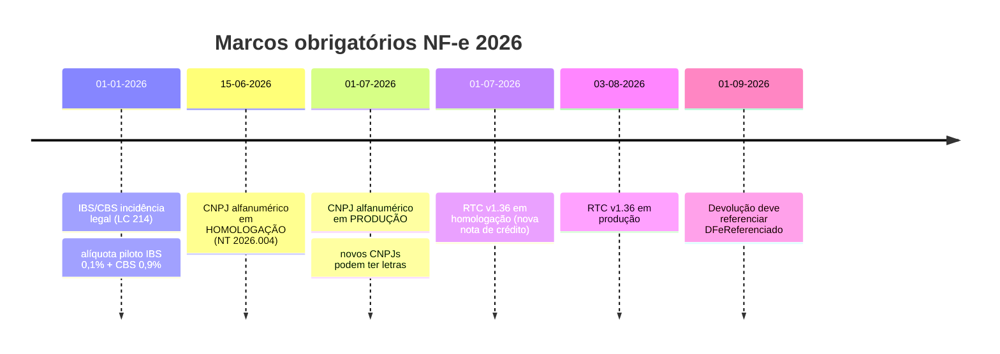
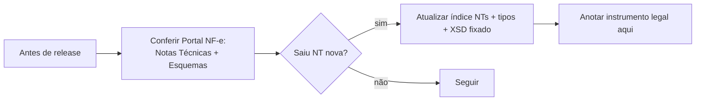

> **Pra que serve:** registro do que foi **checado por pesquisa** (jun/2026) contra fontes oficiais e especializadas, mais o **arcabouço legal** e o **calendário de prazos** que **obrigam** mudança na lib. Aqui mora o "porquê" de cada mudança — útil pra justificar PRs e priorizar.
>
> ⚠️ Datas e versões de NT mudam. **Sempre confirme no Portal NF-e** antes de tratar como definitivo.

---

## Resultado da validação

| Tema | Documentado em | Status | Observação |
|------|----------------|--------|------------|
| Assinatura **SHA-1 + RSA-SHA1 + C14N** | Transmissão/Assinatura | Correto | Continua SHA-1; transforms = enveloped + C14N. **Não** mudou pra SHA-256. |
| Chave/DV **mod 11** | Fundamentos/Chave de Acesso | Correto | Confirmado pelo MOC e ChaveUtil |
| **CNPJ alfanumérico** `[0-9A-Z]{12}[0-9]{2}` | Fundamentos/Chave de Acesso | Correto | DV continua mod 11 (letra = ASCII−48); CPF não muda |
| Chave vira `[0-9]{6}[0-9A-Z]{12}[0-9]{26}` | Fundamentos/Chave de Acesso | Correto | trecho do CNPJ na chave pode ter letra |
| **IBS/CBS** grupo `IBSCBS` no imposto | Reforma/IBS-CBS | Correto, com nuance | falta `IBSCBSTot` + `IS` e o status "rejeição adiada" (ver abaixo) |
| **QR Code v3** sem CSC | DANFE/NFC-e e QR Code | Correto | NT 2025.001 |
| **Resposta síncrona** obrigatória (lote 1) | Transmissão/Webservices | Correto | NT 2025.001 |
| **CRT=4 (MEI)** | Referência/Dicionário | Correto | NT 2024.001 |
| **PAA** | Transmissão/Eventos | Correto, com nuance | base legal: **Ajuste SINIEF 9/22** (ver abaixo) |

> **Veredito:** a base está tecnicamente correta. Os ajustes necessários são **de nuance** (IBS/CBS e PAA), não de erro.

---

## Base legal — o que obriga as mudanças

| Mudança | Instrumento legal | O que determina |
|---------|-------------------|-----------------|
| **CNPJ alfanumérico** | **IN RFB nº 2.229/2024** + NT Conjunta 2025.001 + NT 2026.004 | Novo formato do CNPJ; sistemas (RFB, SEFAZ, SPED) devem aceitar alfanumérico |
| **IBS / CBS / IS** (Reforma) | **EC 132/2023** + **LC 214/2025** | Cria IBS, CBS e Imposto Seletivo; incidência a partir de **01/01/2026** |
| Leiaute IBS/CBS na NF-e | NT 2025.002 (RTC) | Grupos `IBSCBS`, `IBSCBSTot`, `IS` + regras de validação |
| **PAA** (Provedor de Assinatura/Autorização) | **Ajuste SINIEF 9/22** (CONFAZ + RFB) + NT 2026.001 | Permite terceiro homologado assinar/autorizar DF-e |
| Contingência / SVC | **Ajuste SINIEF 07/05** + Convênio ICMS 32/12 | Base do sistema NF-e e das modalidades de emissão |
| Lei da Transparência (tributos no DANFE) | **Lei 12.741/2012** | "Valor aproximado dos tributos" |

> **Para o contribuidor:** quando alguém perguntar "por que esse campo é obrigatório?", a resposta está aqui — não é capricho da lib, é lei/NT. Cite o instrumento no PR.

---

## Calendário de prazos que afetam a lib (jun/2026)

> **Iminente:** **CNPJ alfanumérico entra em produção em 01/07/2026.** A partir daí, **qualquer** validação que trate CNPJ ou chave como "só dígitos" passa a **rejeitar/quebrar** ao receber um CNPJ com letra (emitente, destinatário, transportador, autXML, chave). **Prioridade máxima** se a lib for usada em produção.

---

## Nuance importante: IBS/CBS é lei, mas a rejeição foi adiada

Isto confunde muita gente — registre bem:

- **Juridicamente:** IBS/CBS incidem **desde 01/01/2026** (LC 214/2025). A obrigação de informar **existe**.
- **Tecnicamente:** a regra que **rejeita** a nota por falta dos campos IBS/CBS (rejeição **1115**, regra **UB12-10**) foi **adiada** (NT 2025.002 v1.33/1.34, dez/2025) para "implementação futura".
- **Logo:** hoje a SEFAZ **não rejeita** uma nota sem IBS/CBS — mas a empresa do **Regime Normal** está **legalmente obrigada** a informar. **Simples/MEI**: a partir de **2027**.

**Grupos no XML (NT 2025.002):**

| Grupo | Onde | O que é |
|-------|------|---------|
| `IBSCBS` | item (`det/imposto`) | IBS + CBS por item; CST próprio + `cClassTrib` |
| `IBSCBSTot` | `total` | totalizador de IBS/CBS do documento |
| `IS` | item | Imposto Seletivo (quando aplicável) |

> **Implicação prática pra lib:** trate IBS/CBS como **opcional preenchível agora** (sem rejeição), mas com a estrutura pronta. Quando a rejeição entrar, vira obrigatório pro Regime Normal. Deixe `Imposto` aceitar `ibsCbs?` + `is?`.

---

## Como manter esta validação viva

- Revise **NTs** e **Esquemas XML** a cada ciclo.
- Fontes secundárias confiáveis pra acompanhar (não substituem o oficial): portais das SEFAZ estaduais (SVRS, SEFAZ-AM), ENCAT, e blogs técnicos de ERPs — úteis pra **prazos e interpretação**, mas **a verdade é a NT + o XSD**.
- **CCC / Cadastro Centralizado de Contribuintes** e tabelas (NCM, CFOP, cBenef, cClassTrib) mudam por **Informe Técnico** — trate como dado versionado.

---

## Fontes consultadas nesta validação (jun/2026)

- Receita Federal — IN RFB 2.229/2024 (CNPJ alfanumérico)
- LC 214/2025 + EC 132/2023 (Reforma Tributária)
- NT 2026.004 v1.01, NT 2025.002 (RTC, várias versões), NT 2025.001 (QR v3 / síncrono), NT 2026.001 (PAA), Ajuste SINIEF 9/22
- Portais SEFAZ (SVRS, SEFAZ-AM) e MOC publicado (confirmação de assinatura SHA-1/C14N e chave/DV)

> Tudo o que está marcado como "Correto" acima foi confirmado em **mais de uma fonte**. O que está com "nuance" recebeu o ajuste de detalhe nos arquivos indicados.
