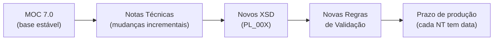
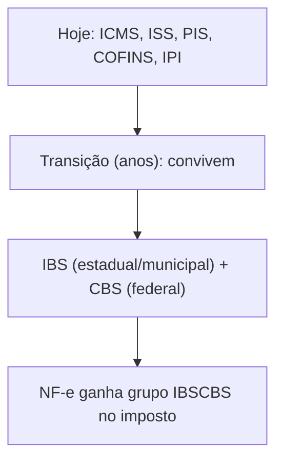

> **TL;DR:** O MOC é a base, mas o que **muda na prática** são as **Notas Técnicas (NT)**. Uma lib séria **rastreia NTs**, não só o MOC. E o ecossistema cresceu: além da NF-e/NFC-e existem **NFGas, NFAg, NF-e ABI** e a **Reforma Tributária (IBS/CBS)** já entrando no leiaute. Decida seu escopo.

---

## Como o leiaute realmente evolui

- **MOC** muda de versão raramente (7.0 é de 2020).
- **Notas Técnicas (NT)** saem o ano todo. Cada uma:
  - acrescenta/altera campos → publica um **novo pacote XSD** (`PL_009`, `PL_010`...);
  - cria/altera **regras de validação** (novos `cStat` de rejeição);
  - tem **data de homologação e produção** — vira obrigatória nessa data.
- **Informes Técnicos** = avisos operacionais (não mudam leiaute).

> **Implicação pra lib:** versione seus tipos/XSD por **NT**, não por "v4.00". O `leiauteNFe_v4.00.xsd` já tem campos de NT recentes (IBS/CBS). Guarde de qual NT/PL cada campo veio.

---

## Onde achar (portal oficial)

| Conteúdo | Localização no portal |
|----------|-----------------------|
| Manuais (MOC + anexos) | Portal NF-e → Documentos → **Manuais** |
| **Notas Técnicas** | Portal NF-e → Documentos → **Notas Técnicas** |
| Informes Técnicos | Portal NF-e → Documentos → **Informes Técnicos** |
| **Esquemas XML (XSD)** | Portal NF-e → Documentos → **Esquemas XML** |
| Relação de Web Services | Portal NF-e → Serviços → **Relação de Serviços Web** |
| **Disponibilidade por UF** | Portal NF-e → Serviços → **Consultar Disponibilidade** |
| Ferramentas (Assinador, Visualizador) | Portal NF-e → **Downloads** |

> Os XSD **mudam** quando sai NT. Sua lib deve apontar pra uma **versão fixada** do pacote XSD e atualizar conscientemente — nunca "pegar o mais novo" cegamente.

---

## Ferramentas oficiais pra validar sua lib

| Ferramenta | Pra quê |
|------------|---------|
| **Assinador** (Portal → Downloads) | confere se sua assinatura está válida |
| **Visualizador de DF-e** | abre o XML/DANFE e valida estrutura |
| **Esquemas XML (XSD)** | validação local automática (libxmljs) |
| **Ambiente de homologação** | teste ponta a ponta sem valor fiscal |

> Contribuidor que mexer em serialização/assinatura deve rodar o XML resultante contra o **XSD oficial** e, idealmente, no **Assinador**. Coloque isso no checklist de PR.

---

## O ecossistema cresceu — defina seu escopo

O portal hoje lista vários documentos fiscais que **compartilham infraestrutura** com a NF-e mas têm leiaute próprio:

| Documento | Modelo / o que é | No seu escopo? |
|-----------|------------------|----------------|
| **NF-e** | mod 55 — mercadorias B2B | Núcleo |
| **NFC-e** | mod 65 — varejo consumidor | Núcleo |
| **NFGas** | Nota Fiscal Eletrônica do Gás | Só se for o nicho |
| **NFAg** | Nota Fiscal da Água e Saneamento (DANFAG) | Idem |
| **NF-e ABI** | NF-e de Aquisição a partir de Bem Importado (minuta) | Idem |

> **Recomendação:** comece com **55 + 65**. A arquitetura modular permite plugar outro documento depois sem reescrever — cada um é "mais um conjunto de builders + XSD". Mas **não** tente abraçar todos no MVP.

---

## Reforma Tributária (IBS/CBS) — a maior mudança chegando

O `leiauteNFe_v4.00.xsd` **já traz** campos da reforma: `cMunFGIBS`, `tpNFDebito`, `tpNFCredito`, `gCompraGov`, `gPagAntecipado`, e o grupo `IBSCBS` no imposto.

**Implicações pra lib:**
- O grupo de imposto vai ganhar **`IBSCBS`** ao lado de ICMS/PIS/COFINS — é só **mais um builder** no `Imposto`. A arquitetura aguenta.
- Vão surgir **novos CST/cClassTrib** próprios do IBS/CBS e novos totais.
- **fiscal-rs já implementa isso** (`tax_ibs_cbs/`) — boa referência se for mirar a reforma desde já.
- Acompanhe as **NTs específicas da reforma** (saindo em 2025-2026) — são a fonte da verdade dos campos.

> **Decisão de escopo:** se o projeto é pra durar, **planeje IBS/CBS como módulo de imposto** desde a arquitetura (mesmo sem implementar agora). Deixe o `Imposto` aceitar um `ibsCbs?` opcional.

---

## Checklist de versionamento da lib

- [ ] Fixar a versão do pacote XSD usado (ex: `PL_010`) — não "latest"
- [ ] Anotar de qual NT veio cada campo novo (comentário no tipo)
- [ ] Ter um teste que valida XML contra o XSD fixado
- [ ] Mapear `cStat` de rejeição por NT (mudam)
- [ ] Documentar no CONTRIBUTING como subir de NT
- [ ] Deixar `Imposto` extensível pra `IBSCBS` (reforma)
